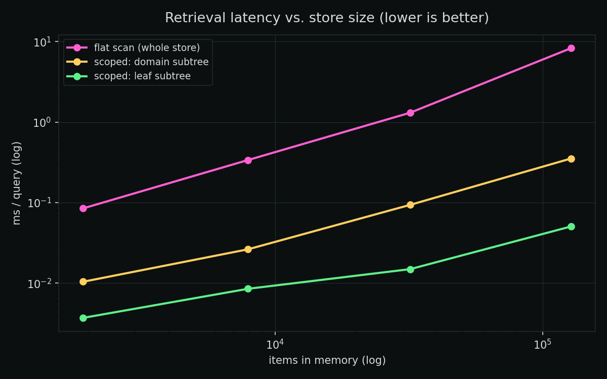
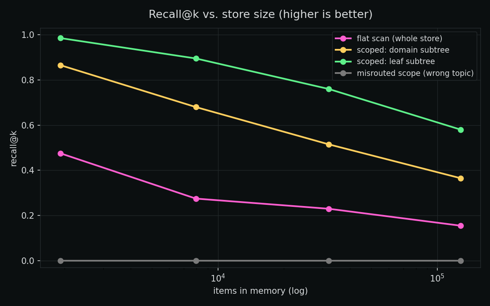
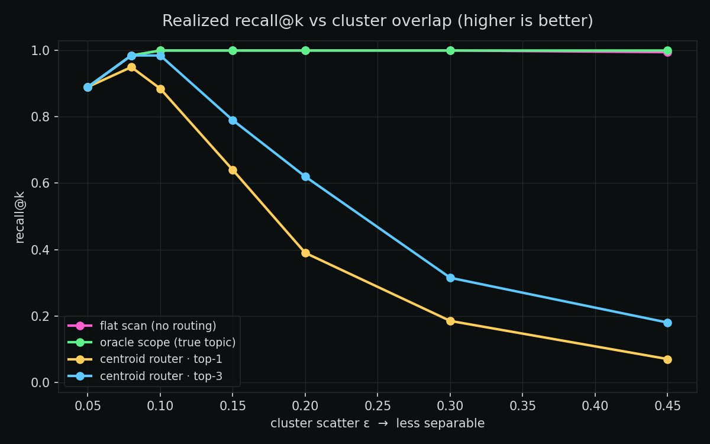
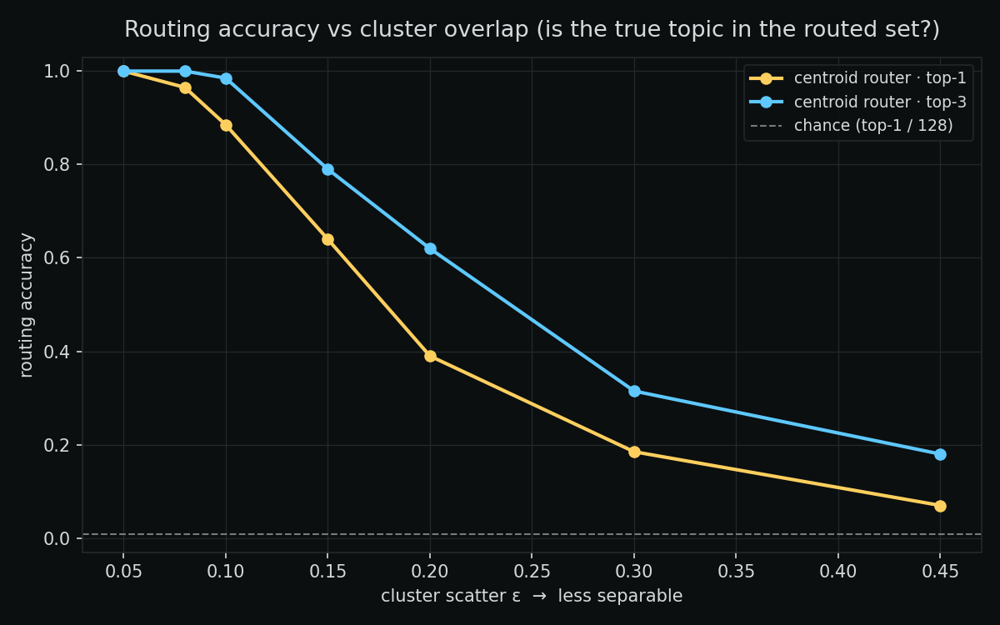
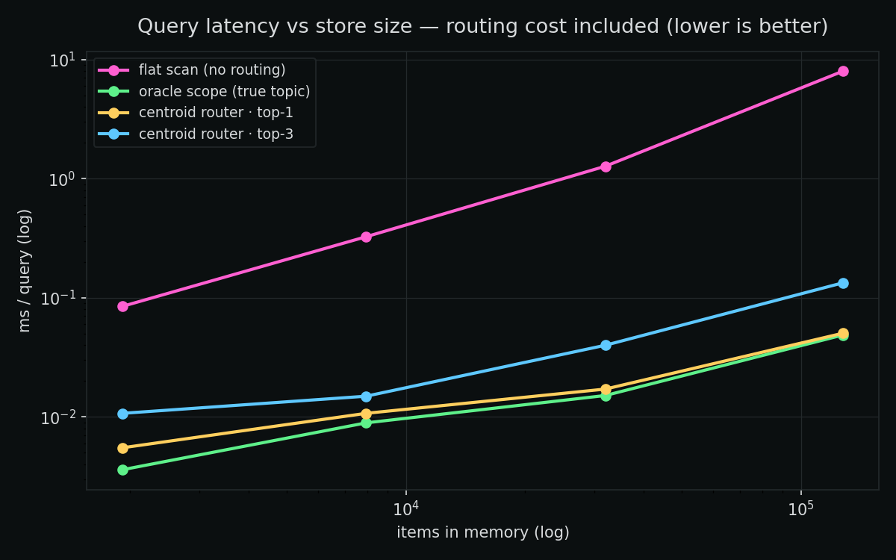

# FMM Benchmark — hierarchical scoping vs. flat semantic search

One question, tested honestly:

> Does **topic-scoped retrieval** ("page the relevant region of memory") beat a **flat
> scan** of the whole store — in latency *and* recall — as memory grows?

This is the semantic-memory analogue of the [UFM benchmark](https://yandesbiens.com/blog/ufm-benchmark/):
both are a **bet on locality**. UFM bets on locality in *physical* memory (VRAM/RAM); FMM
bets on it in *semantic* memory (the topic tree).

## Setup

A synthetic corpus organized into a topic hierarchy (`domain → subtopic`, 16×8 = 128 leaf
topics). Each leaf is a cluster; items are points near their cluster center. For each query
(a perturbed item with a *known* topic) we compare four retrieval strategies:

| mode | searches | analogue |
|---|---|---|
| `flat` | all N items | a flat vector store |
| `scoped_domain` | the query's domain subtree (~N/16) | coarse paging |
| `scoped_leaf` | the query's leaf subtree (~N/128) | fine paging |
| `misrouted` | the **wrong** domain subtree | the honest failure case |

Metrics: median query latency and recall@k (k=5). Vectors are unit-norm; cosine = dot product.

## Quick start

```bash
cd fmm && pip install -e ".[torch]" && pip install matplotlib
cd benchmarks && ./run.sh           # or: python run_benchmark.py && python plot_results.py
python run_benchmark.py --quick     # ~10s
```

The harness also runs a **library correctness check**: that `FractalMemoryMatrix.retrieve(
query, topic_prefix=…)` returns only nodes inside the requested subtree.

## Reproduced result

**Hardware:** CPU, 16 threads. **Software:** torch 2.10.0+cu128, Python 3.x, Linux.
**Corpus:** dim 128, 16 domains × 8 subtopics, eps 0.45, query noise 0.35, 200 queries, k=5.

| N | mode | scope | latency (ms) | recall@k |
|---:|---|---:|---:|---:|
| 128,000 | flat | 128,000 | 8.304 | 0.155 |
| 128,000 | scoped_domain | 8,000 | 0.354 | 0.365 |
| 128,000 | **scoped_leaf** | **1,000** | **0.051** | **0.58** |
| 128,000 | misrouted | 8,000 | 0.345 | 0.000 |

At 128k items, **leaf-scoped retrieval is ~164× faster and ~3.7× more accurate** than a flat
scan. The full sweep (2k → 128k) is in `results/summary.json`.




### What this shows

1. **Flat search degrades on both axes as memory grows.** Latency is ~linear in N; recall
   *falls* (0.48 → 0.155) because every unrelated topic adds distractors that crowd out the target.
2. **Scoping wins on both axes — when the topic is known.** Restricting the search to the
   relevant subtree is sublinear (≈ N/scope faster) *and* lifts recall, because cross-topic
   distractors are never considered. Finer scope (leaf) > coarser scope (domain).
3. **The honest cost: a misrouted scope misses entirely** (recall 0.0). If you scope to the
   wrong region, the target isn't there. Hierarchical memory is a bet on routing locality —
   it pays only when you can address the right region.

## Honest limitations

- **Synthetic embeddings.** This isolates the *structural* question (does scoping help?) from
  embedding quality. Real-embedding corpora + a learned topic router are future work; absolute
  recall will depend on both.
- **Absolute recall is moderate** (within-scope distractors remain at high density); the
  defensible claim is the **relative** advantage and the **scaling trend**, not a recall number.
- **Topic is assumed known** at query time. Production needs a router to choose the scope; a bad
  router lands you in the `misrouted` regime. Measuring router quality is the next proof.
- CPU, cosine via dot product; the harness measures the core retrieval op (a production system
  would also add an ANN index — orthogonal to the scoping question).

## Files

```
corpus.py          synthetic hierarchical corpus
run_benchmark.py   flat vs scoped sweep + library correctness check
plot_results.py    figures
run.sh             run + plot
results/           summary.json, runs.jsonl, figures
```

---

# Proof Drop #3 — does a *cheap* router cash the scoping win?

Proof drop #2 above assumes the topic is **known** (an oracle) and shows a misrouted
scope has recall 0.0. In production nobody hands you the topic — a **router** has to
guess it, so "misrouted" is not a freak event: it is whatever fraction of the time the
router is wrong. This drop replaces the oracle with the cheapest router that could work
and measures the **end-to-end** result.

> **The router:** one centroid per leaf subtree (the mean of its items — a descriptor the
> fractal store already has). Route the query to the nearest centroid(s) by cosine; search
> only the routed region. Cost is `O(n_subtrees × dim)`, independent of store size. Shipped
> in the library as `FractalMemoryMatrix.route()` / `.route_and_retrieve()` (v0.3.0).

We compare `flat` (no routing) · `oracle_leaf` (true topic, the ceiling) · `router_top1`
(best-guess leaf) · `router_top3` (union of the 3 best leaves). Two sweeps: **separability**
(vary cluster scatter ε at fixed N) and **size** (vary N at an ε where routing works).

## Reproduced result

**Hardware:** CPU, 16 threads. torch 2.10.0+cu128, Linux. dim 128, 16×8 = 128 leaves,
query noise 0.15, 200 queries, k=5.

**Routing is nearly free, and cashes the win when memory is organized** (N = 128,000, ε = 0.10):

| mode | scope | latency | recall@k | routing acc |
|---|---:|---:|---:|---:|
| flat | 128,000 | 8.00 ms | 0.985 | — |
| oracle (true topic) | 1,000 | 0.049 ms | 0.985 | 1.00 |
| **centroid router · top-3** | 3,000 | **0.134 ms** | **0.965** | **0.98** |
| centroid router · top-1 | 1,000 | 0.050 ms | 0.905 | 0.92 |

The router decision itself costs **≈ 0.002 ms/query — ~4000× cheaper than the 8 ms flat scan
it replaces.** Top-3 recovers **98 % of the oracle's recall** while staying **~60× faster than
flat**; top-1 is **~159× faster** at 92 % of oracle recall.

**But routing — not retrieval — is the bottleneck, and separability is the gate** (N = 32,000):

| ε (cluster scatter) | oracle recall | router top-1 recall (acc) | router top-3 recall (acc) |
|---:|---:|---:|---:|
| 0.05 (tight) | 0.89 | 0.89 (1.00) | 0.89 (1.00) |
| 0.10 | 1.00 | 0.885 (0.89) | 0.985 (0.98) |
| 0.15 | 1.00 | 0.64 (0.64) | 0.79 (0.79) |
| 0.20 | 1.00 | 0.39 (0.39) | 0.62 (0.62) |
| 0.45 (overlapping) | 1.00 | 0.07 (0.07) | 0.18 (0.18) |





### What this shows

1. **When the memory is well-organized (separable topics), a near-free centroid router cashes
   almost the entire locality check** — oracle recall at ~oracle latency, for ~0.002 ms of routing.
2. **As topics overlap, realized recall falls along a continuous curve that tracks routing
   accuracy** — from the oracle ceiling down toward chance. This turns proof drop #2's *binary*
   "misrouted = 0" into a *measured function of how separable the memory is*.
3. **Top-r is a cheap robustness knob.** Widening top-1 → top-3 roughly triples the scope (still
   tiny) and recovers much of the routing accuracy (e.g. ε = 0.15: 0.64 → 0.79).
4. **The tie-back to proof drop #2:** that benchmark ran at ε = 0.45 — *exactly* the regime where
   this cheap router routes at ~7 %. The oracle advantage #2 measured is real, but a trivial router
   can't realize it at that scatter. **Routing quality gates the whole locality bet.** Keeping the
   memory separable (or using a stronger router) is the lever; that stronger router is the next proof.

## Honest limitations

- **Synthetic embeddings**, same as #2 — isolates the structural question (does cheap routing
  cash the win, and when?) from embedding quality. Real-embedding corpora are future work.
- **ε is a stand-in for "how separable is your memory."** Real corpora won't hand you an ε; the
  transferable claim is the *shape* (routing accuracy gates realized recall) and that a centroid
  router is essentially free, not a specific recall number.
- The centroid router is intentionally the floor. A learned router would push the crossover right;
  measuring that is the open question this drop sharpens.

## Files

```
run_router_benchmark.py   separability + size sweeps + library route() correctness check
plot_router_results.py    figures (separability, routing accuracy, latency)
run_router.sh             run + plot
results/                  router_summary.json, router_runs.jsonl, fig_router_*.png
```
